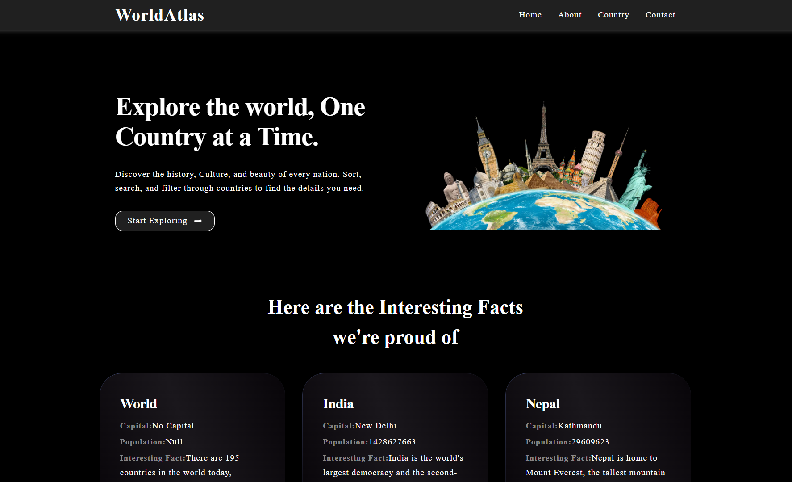
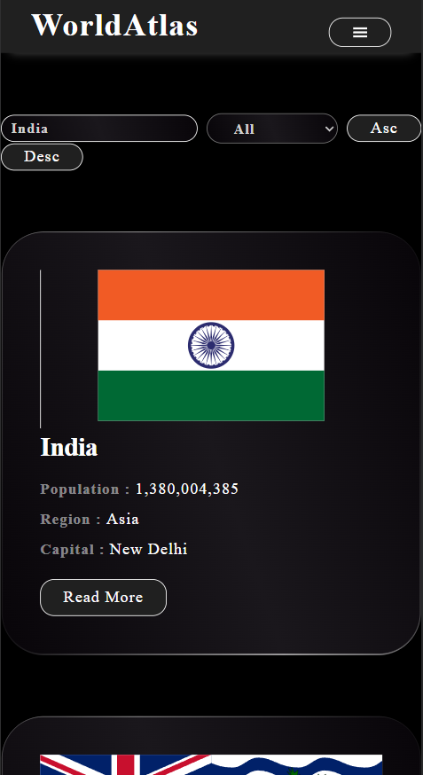

# Atlas World

A modern, responsive web application built with React and Vite, designed to explore countries worldwide. It features dynamic country browsing, search and filter functionality, detailed country views, and a clean UI with reusable components. Data is fetched from the REST Countries API, with static data for footer and facts, and optimized loading states using React's `useTransition` hook.

## Key Features

### User Features

- **Country Exploration**:
  - Browse a list of countries with key details (name, population, region, capital).
  - View detailed country information including native names, currencies, languages, and flags.
- **Search & Filter**:
  - Search countries by name with real-time results.
  - Filter countries by region (Africa, Asia, Americas, Europe, Oceania).
  - Sort countries alphabetically (ascending/descending).
- **Dynamic Navigation**:
  - Responsive header with hamburger menu for mobile.
  - Footer with contact info, social links, and navigation.
- **Interesting Facts**:
  - Curated country facts displayed on the About page from `countryData.json`.
- **Contact Form**:
  - Simple form with console logging for submissions.

### Technical Highlights

- **Performance**:
  - React’s `useTransition` hook for smooth UI updates.
  - Custom `Loader` component for API fetch feedback.
- **Error Handling**:
  - `ErrorPage` component for 404s and route errors.
- **Deployment**:
  - Configured for GitHub Pages with custom deploy script.

## Project Structure

atlas-world/
├── public/ # Static assets
├── src/ # Source files
│ ├── api/ # API services and static data
│ │ ├── countryData.json # Static country facts for About page
│ │ ├── footerApi.json # Footer contact data
│ │ └── postApi.jsx # Axios setup for REST Countries API
│ ├── assets/ # Static images
│ ├── components/ # Reusable components
│ │ ├── layout/ # Layout-specific components
│ │ │ ├── AppLayout.jsx # Main layout with header/footer
│ │ │ ├── CountryCard.jsx # Country preview card
│ │ │ └── CountryDetails.jsx # Detailed country view
│ │ └── ui/ # UI components
│ │ ├── Footers.jsx # Footer with contact info
│ │ ├── Headers.jsx # Header with navigation
│ │ ├── HeroSection.jsx # Home page hero
│ │ ├── Loader.jsx # Loading spinner
│ │ └── SearchFilter.jsx # Search and filter controls
│ ├── pages/ # Page components
│ │ ├── About.jsx # Country facts page
│ │ ├── Contact.jsx # Contact form page
│ │ ├── Country.jsx # Country list page
│ │ ├── ErrorPage.jsx# 404/error page
│ │ └── Home.jsx # Landing page
│ ├── App.jsx # Main app with routing
│ └── App.css # Global styles
├── package.json # Project metadata and scripts
├── index.html # Entry HTML file
└── vite.config.js # Vite configuration

## Dependencies

- **Runtime**:
  - `axios`: ^1.8.4 - HTTP requests
  - `gh-pages`: ^6.3.0 - GitHub Pages deployment
  - `react`: ^19.0.0 - Core library
  - `react-dom`: ^19.0.0 - DOM rendering
  - `react-icons`: ^5.5.0 - Icon components
  - `react-router-dom`: ^7.4.0 - Routing
- **Dev**:
  - `@vitejs/plugin-react`: ^4.3.4 - React plugin for Vite
  - `eslint`: ^9.21.0 - Linting
  - `vite`: ^6.2.0 - Build tool

## Screenshots

# Desktop view :



# Mobile view :



## How to Run the Project

### Prerequisites

- Node.js (v14.0.0 or later)
- npm (v6.0.0 or later)

### Installation

1. **Clone the Repository**:

   ```bash
   git clone https://github.com/Siddharth-AI/atlas-world.git

   ```

2. **Navigate to Project Directory**:
   cd atlas-world
3. **Install Dependencies:**
   npm install

### Available Routes

1. / - Home page with hero and facts
2. /about - Country facts from countryData.json
3. /country - Browse countries with search/filter
4. /country/:id - Detailed country view
5. /contact - Contact form
6. - - Error page

### API Integration

- Source: REST Countries API (https://restcountries.com/v3.1)
- Endpoints:
  - /all - Country list (name, population, region, capital, flags)
  - /name/{name} - Detailed country data
- Static Data:
  - countryData.json - Facts for About page
  - footerApi.json - Footer contact info
- Styling
  - Custom CSS with:
  - Responsive grid layouts
  - Gradient cards
  - Mobile-friendly hamburger menu

### Contributing

- Fork the repository.
- Create a feature branch (git checkout -b feature/new-feature).
- Commit changes (git commit -m "Add new feature").
- Push to the branch (git push origin feature/new-feature).
- Open a Pull Request.

### Future Enhancements

- Add authentication for user profiles.
- Implement pagination for country list.
- Integrate a CSS framework (e.g., Tailwind).
- Add more static data to countryData.json.

### License

- MIT License - see for details.

### Author

- Siddharth-AI

### Acknowledgments

- REST Countries API for country data.
- Vite for fast development.
- GitHub Pages for hosting.
